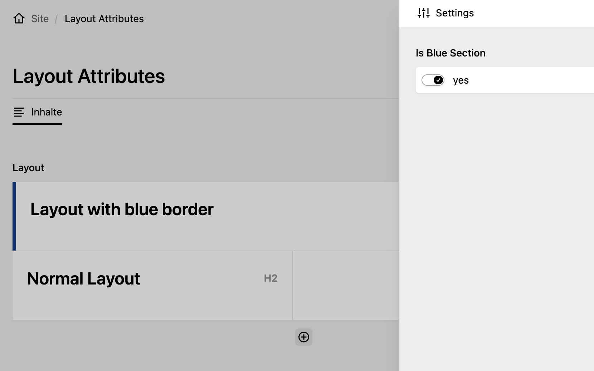
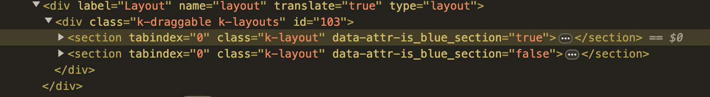

# kirby-layout-attributes

A Kirby plugin to use [layout settings](https://getkirby.com/docs/reference/panel/fields/layout#layout-settings)
in the panel.

It sets all layout settings as `data-`-Attributes so you can use them in you panel styles.

